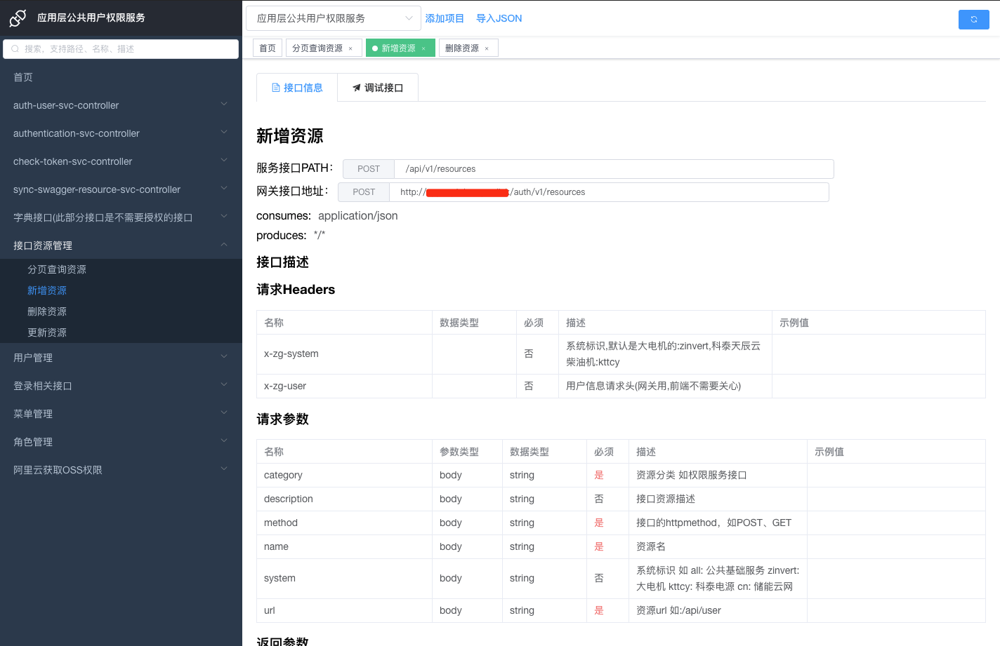

Swagger接口管理平台 是从开源 https://gitee.com/durcframework/swagger-admin/releases 修改而来

不直接用而需要修改的原因有：
> 1 该开源的路由设计不太合理，无法通过接口地址url直接打开接口详情。通常情况下，当前端问某个接口在哪，我们可能直接copy整个接口的url文档地址给前端，如果无法打开则无法满足我们的要求。
> 
> 2 我们的接口一般都会经过网关，并且经过网关的接口地址可能都会有所变更，而之前的接口地址是不支持配置网关地址的，优化之后可以配置网关地址和替换规则，确保前端直接就能看到经过网关之后的接口地址，并能直接调试。
> 
> 3 切换项目服务后，会直接强刷整个页面，导致之前正在调试的接口的tab页不见了，需要重新梳理回来。
> 
> 4 接口文档的缓存设计方式不太合理，如果服务重启了缓存在内存的文档也不见了，前端点击接口文档接口会直接报错。
>
> 5 针对swagger v3的接口文档解析有挺多bug，针对v2的还好。

其他优化:
> 1 接口tab的颜色调整，与接口的method一一对应
> 
> 2 重新定义菜单路由的初始化策略和刷新策略
>
> 3 解决了发现的一些其他bug
>

界面如截图：

